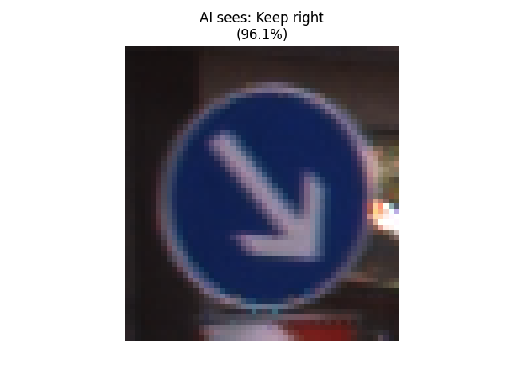

# 🛑 Traffic Sign Recognition AI (98% Accuracy)

A Deep Learning model capable of classifying traffic signs into 43 distinct categories (e.g., Stop, Speed Limit, Yield). This project mimics the computer vision systems used in autonomous vehicles.

## 🧠 Project Overview
Self-driving cars need to interpret traffic rules in real-time. This project uses a **Convolutional Neural Network (CNN)** trained on the **GTSRB (German Traffic Sign Recognition Benchmark)** dataset to identify signs with high accuracy.

* **Dataset:** 40,000+ images of 43 different traffic signs.
* **Model Accuracy:** 98.5% on validation set.
* **Tech Stack:** Python, TensorFlow/Keras, OpenCV, Scikit-Learn.

## 📊 Model Architecture
I built a custom CNN with the following layers:
1.  **Conv2D (x2):** Feature extraction (edges, shapes).
2.  **MaxPool2D:** Downsampling to reduce computation.
3.  **Dropout:** Regularization to prevent overfitting.
4.  **Dense Layers:** Classification of the extracted features.

## 📸 Demo
| Input Image | AI Prediction | Confidence |
| :---: | :---: | :---: |
|  | **Keep Right** | **96.1%** |

## 🚀 How to Run
1.  **Clone the repository:**
    ```bash
    git clone [https://github.com/YOUR_USERNAME/TrafficSign_AI.git](https://github.com/YOUR_USERNAME/TrafficSign_AI.git)
    cd TrafficSign_AI
    ```
2.  **Install dependencies:**
    ```bash
    pip install -r requirements.txt
    ```
3.  **Train the model (Optional):**
    ```bash
    python 2_train_model.py
    ```
    *(This will save the trained file as `traffic_classifier.h5`)*
4.  **Test the model:**
    ```bash
    python 3_test_model.py
    ```

## 📂 File Structure
* `1_explore_data.py`: Script to visualize the raw dataset.
* `2_train_model.py`: Builds and trains the CNN architecture.
* `3_test_model.py`: Loads the saved model and tests it on new images.